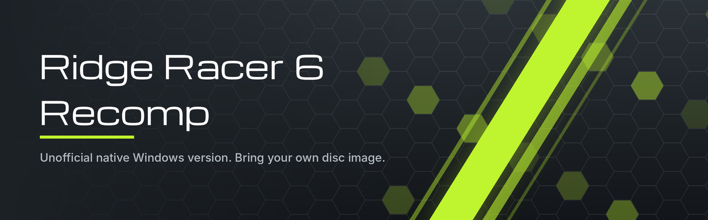

# Ridge Racer 6 Recomp

An unofficial, fan-made native Windows version of **Ridge Racer 6** (Xbox 360,
2005). The game's PowerPC program is translated to C++ and compiled into a
Windows executable that runs on top of the
[ReXGlue SDK](https://github.com/rexglue/rexglue-sdk). Status: early test
release.

> **You need your own copy of Ridge Racer 6 for the Xbox 360** (USA disc, title
> ID `4E4D07D3`). This repository contains no game code and no game data. The
> releases contain the recompiled program and none of the game's data: tracks,
> cars, sound and video all come from your own disc image.

Not affiliated with or endorsed by Bandai Namco Entertainment, who own Ridge
Racer and its trademarks.

## Install

1. Download the latest `RidgeRacer6-PC-<version>.zip` from
   [Releases](../../releases).
2. Unzip it to a normal, writable folder (not Program Files, and do not run it
   from inside the zip).
3. Start `RR6 Launcher.exe`. Windows may warn about it; see
   [If Windows warns about the download](#if-windows-warns-about-the-download).
4. Press **Choose disc image...** and pick your Ridge Racer 6 `.iso`, wherever
   it is. The launcher checks that it is the right game and copies the game
   files out of it (about 6 GB, a few minutes, once). The image is only read and
   is not needed again afterwards.
5. Choose your settings (the defaults suit most PCs) and press **Play**.

`README.txt` in the zip has the details, including how to report a problem.

## If Windows warns about the download

The programs in the zip are not code-signed, and every new release is a file
that few people have downloaded yet. Windows and Edge warn about any download
like that, whatever is in it. The package does not install anything and does
not ask for administrator rights.

- **Edge blocks the download** ("isn't commonly downloaded"): open the
  downloads list, choose the three dots next to the file, then **Keep**, then
  **Show more**, then **Keep anyway**.
- **Before unzipping:** right-click the zip, choose **Properties**, tick
  **Unblock** and press OK. Otherwise Windows may ask again for each program
  in the folder.
- **"Windows protected your PC" on the first start:** choose **More info**,
  then **Run anyway**.

To check that the file is the one published here, compare its SHA-256 with
`SHA256SUMS.txt` on the release page. In PowerShell, with the file's name:

    Get-FileHash .\RidgeRacer6-PC-v0.1.0.zip

If your antivirus names a specific threat instead of giving one of the
warnings above, please [open an issue](../../issues) with its exact wording.

## Features

- **Launcher** with display settings, key bindings and the disc-image copy.
  The picture at its top is taken on your PC from the opening movie of your own
  copy; no artwork is shipped.
- **Sharper picture:** renders at up to 4x the original 720 lines, chosen
  automatically for your screen, with optional FXAA and 16x texture filtering.
- **Ultrawide:** fills screens wider than 16:9 (played at 21:9), with the race
  HUD moved to the screen edges or kept where 16:9 had it.
- **Controllers:** Xbox and PlayStation pads through SDL, with no setup.
- **Keyboard:** works alongside a controller; every key can be changed.
- **Saving** to `Documents\rr6_recomp`.
- **Bug reports:** the launcher can record a detailed log and pack it, with
  your PC's specifications and without your Windows user name, into one zip.

The game runs at 60 frames per second, as it did on the console.

## Requirements

- Windows 10 or 11, 64-bit
- A graphics card with DirectX 12 support
- About 6.5 GB of free disk space
- The Microsoft Visual C++ 2015-2022 runtime (x64); the launcher says so if it
  is missing
- Your own Ridge Racer 6 (USA) disc image

## Controls

Controllers work as soon as they are connected. The game shows Xbox button
names.

| Keyboard | Controller |
|---|---|
| Arrow keys or W A S D | Left stick (Up or W also accelerates, Down or S also brakes) |
| Space | A (confirm) |
| Backspace or B | B (cancel) |
| X, Y | X, Y |
| Q, E | LB, RB |
| Enter or P | Start (pause) |
| Tab | Back |
| Numpad 8 2 4 6 | D-pad |
| I K J L | Right stick |

While playing: F4 opens the settings, F3 shows frame-rate statistics, Alt+F4
closes the game.

## Known limitations

- Played on one PC only so far (NVIDIA RTX 3060 Ti, 3440x1440), in short
  sessions. AMD and Intel graphics are untested, as are PlayStation
  controllers, most tracks and cars, long sessions and the ending videos.
- Online play and Xbox Live features do not work.
- Only the USA disc is accepted.
- On ultrawide screens the videos and the loading screen are stretched, and a
  few menu decorations stop where the 16:9 picture would end.
- Keyboard steering is all-or-nothing; a controller is the better way to play.
- Without a sound output device the game closes right after starting (the
  launcher warns about this).
- Windows only for now. The same sources build on Linux, but that build has
  only been used for testing.

## Building it yourself

See [BUILDING.md](BUILDING.md). In short: your own `default.xex`, the ReXGlue
SDK v0.10.0, Visual Studio's C++ build tools and Clang, then
`build-windows.bat`.

## Reporting problems

Open an issue and say what you were doing (track, car, mode), what went wrong,
and which graphics card you have. A screenshot helps for anything visual. For
crashes, tick "Record a detailed log" on the launcher's Troubleshooting page,
reproduce the problem, and attach the `bug-report.zip` it creates.

## Good to know

- Use your own disc image and your own save data. The launcher checks that an
  image is the right game, but the game trusts everything else in it and in
  save files, as it did on the console.
- The launcher has no network features. The game's online modes do not work,
  and what they attempt on a PC has not been tested: leave "Online Battle"
  alone.
- Each release lists SHA-256 values for its files so that a download can be
  checked.

## Credits

- [ReXGlue SDK](https://github.com/rexglue/rexglue-sdk), the recompiler and
  runtime this is built on, and the [Xenia](https://xenia.jp) project it
  derives from
- [SDL](https://libsdl.org) and the community
  [SDL_GameControllerDB](https://github.com/mdqinc/SDL_GameControllerDB)
- [pl_mpeg](https://github.com/phoboslab/pl_mpeg) by Dominic Szablewski

## Licence

The project's own files are under the BSD 3-Clause licence in `LICENSE`.
Third-party parts keep their own licences: see `THIRD_PARTY_NOTICES.md`.
Ridge Racer 6 itself belongs to Bandai Namco Entertainment.

`docs/` holds the development notes: what had to be found and fixed to get the
game running, and findings about the SDK written up for reporting upstream.
